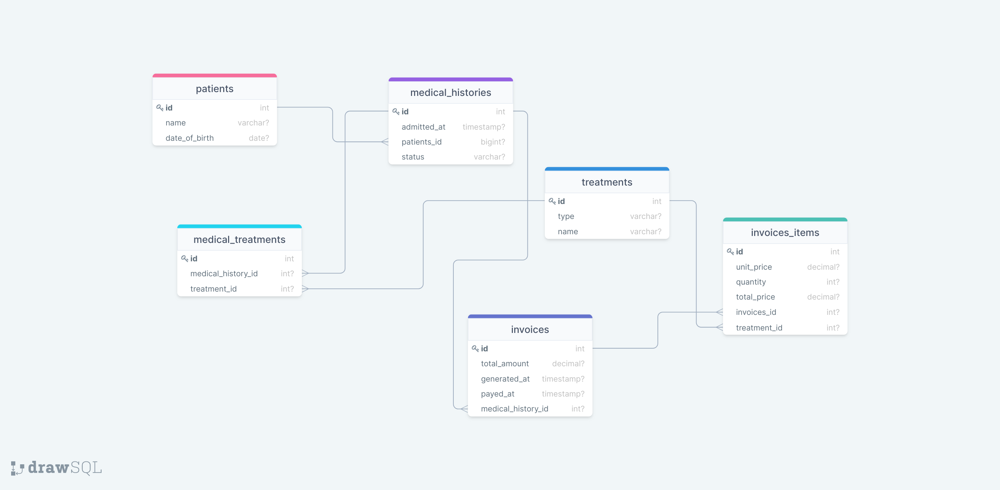

### Clinic Database

## Authors

👤 **Levy**

- GitHub: [@githubhandle](https://github.com/levy002)
- LinkedIn: [LinkedIn](https://www.linkedin.com/in/levy-ukwishaka/)

👤 **Matchoudi**

- GitHub: [@githubhandle](https://github.com/LionRouge1)
-- Twitter: [@Matchoudi1](https://twitter.com/Matchoudi1)
- LinkedIn: [matchoudi](https://linkedin.com/in/matchoudi)

### Clone this repository : `git@github.com:levy002/Clinic_Database.git`

## 🤝 Contributing

Contributions, issues, and feature requests are welcome!

Feel free to check the [issues page](../../issues/).

## Show your support

Give a ⭐️ if you like this project!

## Acknowledgments

- Hat tip to anyone whose code was used
- Inspiration
- etc

## 📝 License

This project is [MIT](./MIT.md) licensed.
